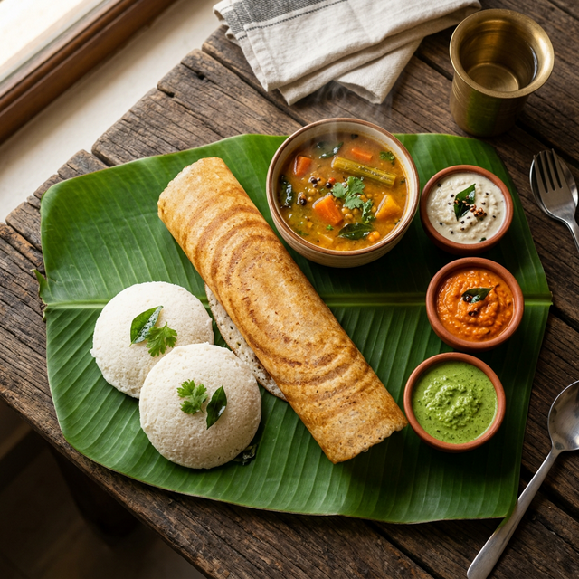

# 🥞 Naati Dosa — Premium South Indian Creperie

A high-fidelity, interactive digital menu and restaurant showcase for **Naati Dosa**, featuring authentic South Indian cuisine with a modern, "boutique" aesthetic. Built with **React**, **framer-motion**, and **Tailwind CSS**.



---

## ✨ Experience the Menu

This project is designed to provide a "cinematic" food discovery experience. It's not just a list of items; it's an interactive journey through the flavors of South India.

### 🍱 Key Features

- **🎯 Smart Menu Navigation**: Sticky category header with horizontal scrolling and Intersection Observer integration to automatically highlight the current section as you scroll.
- **🌱 Dietary Intelligence**: Instant filtering for **Vegan** and **Gluten-Free (GF)** options.
- **🔍 Global Search**: Real-time fuzzy search across all categories and descriptions.
- **💫 Boutique Animations**: Powered by `framer-motion` for smooth layout transitions, search overlays, and entry animations.
- **📱 Mobile-First Design**: Optimized for "one-handed" browsing, perfect for customers arriving at the restaurant.
- **🎨 Rich Aesthetics**: A curated color palette (Cream, Espresso, Brown) with glassmorphism effects and Playfair Display serif typography.

---

## 🛠️ Tech Stack

- **Frontend**: React 18
- **Animations**: Framer Motion
- **Icons**: Lucide React
- **Styling**: Tailwind CSS + Custom CSS Variables
- **Routing**: React Router DOM
- **Deployment**: Optimized for Vercel/Netlify

---

## 📦 Getting Started

1. **Clone the repository**:
   ```bash
   git clone <repo-url>
   cd naati-dosa-website
   ```

2. **Install dependencies**:
   ```bash
   npm install
   ```

3. **Run the development server**:
   ```bash
   npm run dev
   ```

---

## 🏗️ Architecture & Philosophy

The project follows a **Component-First** architecture:
- **`MenuPage.tsx`**: The core engine, handling complex filtering logic and scroll synchronization.
- **`OrderPopup.tsx`**: A reusable modal system for item details and ordering intent.
- **`data/menu.ts`**: Centralized menu management, allowing easy updates to pricing, availability, and images.

### Design Principles:
- **Zero Placeholders**: Every item has a high-quality visualization.
- **Performance**: Intersection Observers prevent heavy layout thrashing during scroll.
- **SEO**: Semantic HTML5 tags (`<header>`, `<section>`, `<article>`) for better search indexing.

---

## 🥞 Naati Dosa Specials

Traditional South Indian crepes made from fermented rice and lentil batter. Naturally gluten-free, light, and crispy.
- **Plain Dosa**: A classic golden crepe served with house-made chutneys.
- **Ghee Karam Dosa**: A bold, spicy chili-garlic paste spread with rich clarified butter.
- **Egg Dosa**: Savory layer spread on a crispy crepe.

---

## 📝 License

Designed and developed by **Varun Tej** — A demonstration of premium web aesthetics and performance.
